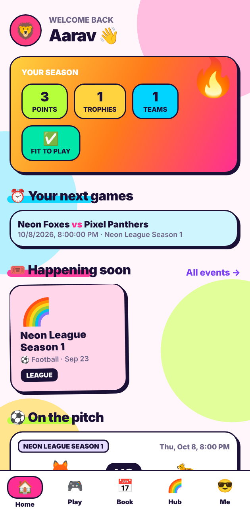
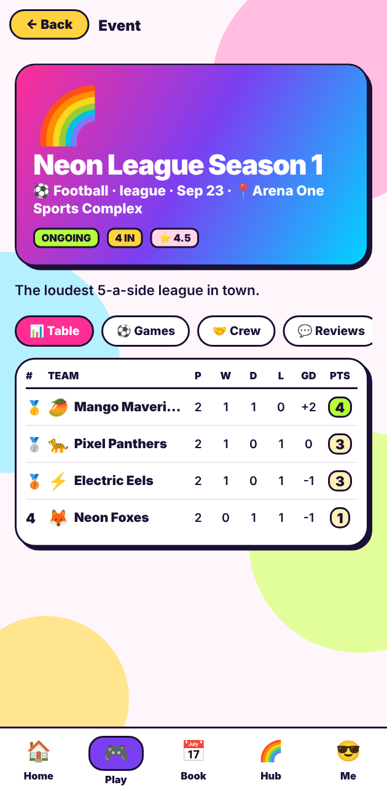
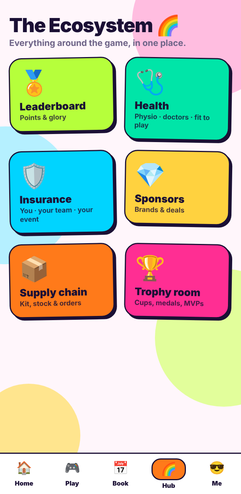
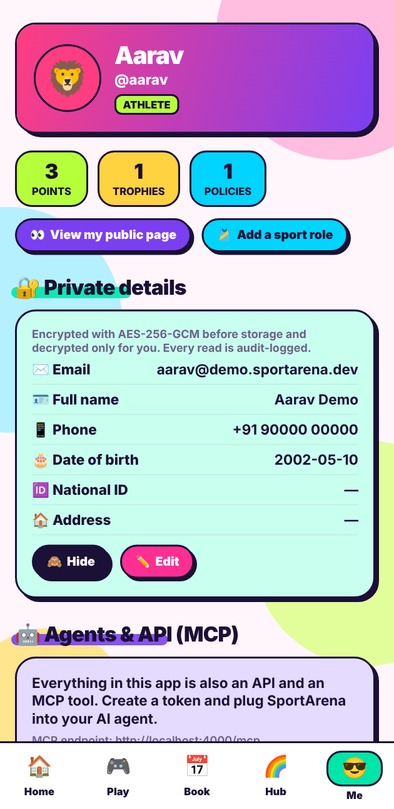

# 🏆 SportArena

**One platform for everyone who dreams of sport** — athletes, coaches, referees, organizers, venues, sponsors,
physios & doctors, suppliers and insurers. **API-first. MCP-first.** One React Native codebase for iOS, Android and web.

| | |
|---|---|
|  |  |
|  |  |

## What's in the MVP

| Area | What you can do |
|---|---|
| **Identity & people** | Register with roles (athlete, coach, referee, organizer, venue manager, sponsor, physio, doctor, supplier, insurer); sport profiles per role; public profiles with no PII; API tokens |
| **Teams** | Create teams, trophy cabinet, fan wall; **team management** — roster, player availability, invitations, recruiting players/coaches, per-event & per-match squads with roles, rates and a settlement ledger; **team chat** — see [docs/teams.md](docs/teams.md) |
| **Events & schedule** | Tournaments/leagues/camps/trials, entries + approval, **auto round-robin scheduling**, referee + team clash detection, results, **live standings with configurable points**, one-click "finish & award" (cup/silver/bronze) |
| **Player marketplace** | Billboard of demands (players wanted for a match, teams recruiting, sponsorship requests/calls) with accept/decline; sports shop with atomic stock + encrypted delivery address; hire coaches; book physios/doctors; buy personal insurance — all inside the Player tab |
| **Payments** | Stripe + PayPal hosted checkout for shop orders, coach sessions and insurance; verified webhooks, refunds on cancel — see [docs/payments.md](docs/payments.md) |
| **Scores & awards** | Individual performances (goals, times…), personal stats/bests, leaderboards, cups/trophies/medals/MVP/badges |
| **Player** | One card per sport profile (default always first), match-by-match performance with sport-specific stats, CSV/JSON bulk import with dry-run + row-level errors |
| **Venues, grounds, courts, equipment** | Resource catalogue with capacity + hourly price, availability, **race-free bookings** (advisory-locked; equipment pools supported); fixtures can book the pitch atomically |
| **Venue management & reservations** | Any sport; many courts/tables per venue with their own capacity, players and slot length; geo + map links, hours, encrypted contacts, staff; peak/off-peak **pricing rules**, **discounts** & promo codes; **multi-slot / multi-court / multi-venue** atomic reservations, **compare venues**, modify & cancel with a refund policy; **bulk blocks**, admin **override**, **reports**, **notifications** — see [docs/venue-reservations.md](docs/venue-reservations.md) |
| **Sponsors** | Brand profiles (encrypted contacts), offers to events/teams/athletes, accept/decline workflow |
| **Supply chain** | Inventory, low-stock flags, supplier orders; receiving an order restocks atomically |
| **Health** | Find physios/doctors, appointments, **athlete-controlled consent**, encrypted clinical notes, fit-to-play status without clinical detail |
| **Insurance** | Plans for individual / team / event, policies (encrypted number + beneficiary), claims with coverage checks, admin review |
| **Verification** | Request a verified badge (gamer, coach, physio, doctor, sponsor, event) as a case with encrypted evidence; platform-team queue with reviewer checklist, decisions, expiry and revocation — see [docs/verification.md](docs/verification.md) |
| **Insurance** | An `insurer` role with its own desk (profile, plans + labelled offers, quote inbox, book of business, claims); searchable/comparable plans; quote requests for a person, team, event or tournament, tracked end to end; accept a quote → cover assigned → pay; renewals with reminders; encrypted document locker; claim review — see [docs/insurance.md](docs/insurance.md) |
| **Doctors & physios** | Public provider profiles, weekly hours and bookable slots, server-side search (type, sport, location/remote, price, rating, verified), scoped and revocable consent — see [docs/health.md](docs/health.md) |
| **Support & disputes** | Support tickets and disputes as one case model that links bookings, payments, events or games; user thread vs internal notes, SLA queue, escalation, immutable timeline — see [docs/cases.md](docs/cases.md) |
| **Youth & guardians** | Verified guardian–child links (invite, accept, evidence, platform review, expiry), purpose-specific consent (participation, medical, media, contact), restricted youth visibility, pickup delegation and check-in, jurisdiction-configurable age policy — see [docs/guardians.md](docs/guardians.md) |
| **Community** | Ratings & testimonials for people, teams, events, venues, sponsors |

## Architecture: one capability registry → REST + OpenAPI + MCP

```
apps/api/src/capabilities/*.js   ← every feature is ONE definition: name, schema (zod), roles, handler
          │
          ├── http.js     REST routes      /api/v1/...      (+ /api/v1/openapi.json, generated)
          ├── mcp.js      MCP tools        POST /mcp  (Streamable HTTP)  and  npm run mcp (stdio)
          └── invoke.js   the single place auth, validation and handlers run
apps/app/                        ← Expo (React Native + react-native-web); talks only to the REST API
```

REST, the generated OpenAPI spec and MCP tools **cannot drift**: there are 240+ capabilities and the tests assert
`tools/list` and the OpenAPI operations both equal the registry. The mobile/web app is just another API client — no
privileged backdoors — so anything a user can do in the app, an agent can do over MCP with the same permissions.

### Use it from an AI agent
1. In the app: **Me → Agents & API → New API token** (or `POST /api/v1/me/tokens`).
2. Point your MCP client at `http://localhost:4000/mcp` with `Authorization: Bearer sa_…`
   (see [`.mcp.json.example`](.mcp.json.example); a stdio server is included too).
3. Tool names match OpenAPI `operationId`s, e.g. `create_event`, `generate_round_robin`, `create_booking`, `record_result`, `buy_policy`.

Full end-to-end picture (components, runtime flows, trust boundaries, deployment, failure modes): [docs/architecture.md](docs/architecture.md).

## Security model for personal data

* **Field-level encryption at rest** — AES-256-GCM, random IV per value, ciphertext **bound to its column** (AAD), keys derived by HKDF from `SPORTARENA_MASTER_KEY`. Encrypted: email, full name, phone, date of birth, national ID, address, license numbers, sponsor contacts, appointment reasons, medical records, policy numbers, beneficiaries, claim descriptions. A DB dump alone reveals none of it (a test asserts this).
* **Blind index** — email lookup for login uses HMAC-SHA256, so email is never stored in plaintext, even for lookups.
* **Passwords** — scrypt with per-user salt, constant-time compare.
* **In transit** — HTTPS enforced in production (HTTP gets `426`), HSTS preload, in-process TLS 1.2+ (`SSL_KEY_FILE`/`SSL_CERT_FILE`) or behind a proxy (`TRUST_PROXY`), `DATABASE_SSL=true` for TLS to Postgres, `Cache-Control: no-store`, helmet headers, rate limits (strict on auth).
* **Least exposure** — public endpoints return handles/display names only. Decrypted data goes only to its owner (or, for health data, a provider the athlete explicitly consented to — revocable any time).
* **Audit trail** — every read of decrypted PII/clinical data writes to `audit_log` (who, what, when — never values).
* **Mobile** — token stored in Keychain/Keystore via `expo-secure-store`.

### Known limits (next steps, deliberately not faked in the MVP)
* The master key lives in an env var. For production use a KMS/HSM and rotate via the `v1.` ciphertext prefix (versioning is already in the format).
* Provider/referee/physio/doctor roles are self-declared; add credential verification by an admin before real clinical use. (Consent still protects athletes: an unverified "doctor" sees nothing without a grant.)
* Payments use hosted checkout (Stripe/PayPal, see [docs/payments.md](docs/payments.md)); payouts to sellers, coaches and venues are not built.
* Encryption at rest of the Postgres disk/backups is an infrastructure concern; this app encrypts the sensitive fields itself on top of it.
* Web stores the token in `localStorage`; ship with a strict CSP (or move to httpOnly cookies) before launch.

## Run it

Requirements: Node 22+, PostgreSQL 14+ (needs `gen_random_uuid()`; Postgres 15+ for `UNIQUE NULLS NOT DISTINCT`).

```bash
npm install
npm run setup            # writes .env with fresh keys (never commit it; losing the master key = losing the data)
createdb sportarena      # and edit DATABASE_URL in .env if needed
npm run migrate
npm run seed             # demo data; password for all demo users: sportarena-demo
npm run api              # → http://localhost:4000  (REST /api/v1, OpenAPI /api/v1/openapi.json, MCP /mcp)
npm run app              # Expo dev server: press w (web), i (iOS), a (Android) or scan the QR
```

Demo logins (`@demo.sportarena.dev`): `aarav` (athlete), `kavya_events` (organizer), `arena_one` (venue), `volt_drink` (sponsor), `dr_rhea` (doctor), `ref_imran` (referee), `admin`.
On a physical phone set `EXPO_PUBLIC_API_URL=http://<your-LAN-ip>:4000`.

```bash
npm test                 # end-to-end suites against a real Postgres (TEST_DATABASE_URL to override)
```
The suite covers: ciphertext-only storage & column binding, role gating, API tokens, tournament lifecycle,
**8 parallel bookings for one court → exactly 1 wins**, referee/team clash detection, consent-gated medical records,
insurance & claims, sponsorship approval rules, supply receiving, testimonials, and MCP ↔ REST ↔ OpenAPI parity.

## Deployment
AWS EC2 (pm2 + Docker Postgres + nginx, KMS-wrapped keys), side by side with other apps: see [`docs/deployment.md`](docs/deployment.md).

## Roadmap
Payouts / settlement · live scores · knockout & group-stage brackets · media (photos/video highlights) ·
KYC · multi-currency & i18n · organizations/clubs · webhooks · offline mode in the app.
