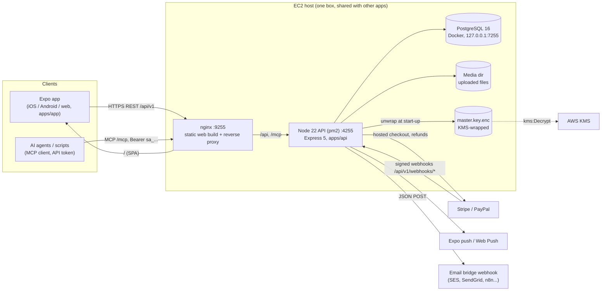
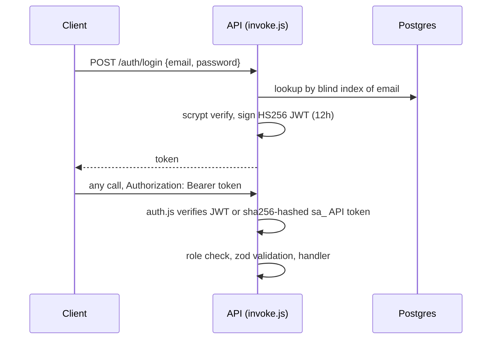
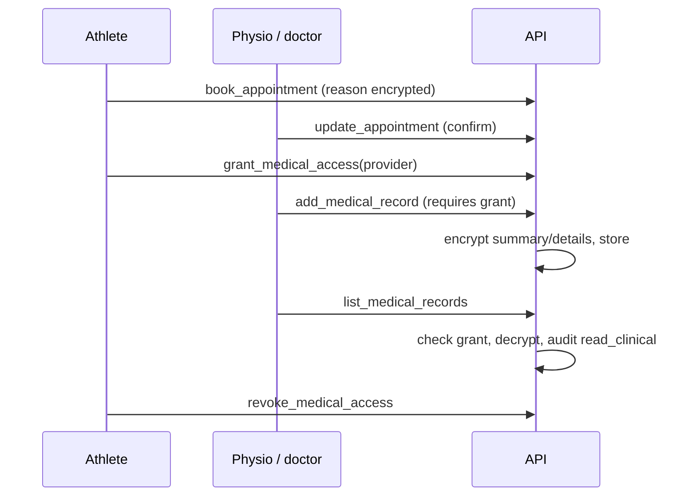

# End-to-end architecture (SPOR-3)

Current-state description of SportArena as built in this repository. It documents what exists today; where something
is missing it says so under [Gaps and proposed ADRs](#gaps-and-proposed-adrs) rather than describing it as built.

## 1. System context



## 2. Components

### 2.1 Clients (`apps/app`)
* Expo (React Native + react-native-web). One code base for iOS, Android and web.
* `App.js` holds a bottom tab bar (Home, Play, Player, Book, Ecosystem, Me) plus a pushed-page stack; providers are
  session, navigation and basket.
* `src/api.js` is the only way the app reaches the backend: a thin REST client. The base URL is
  `EXPO_PUBLIC_API_URL` (empty on web means same origin).
* Tokens live in `expo-secure-store` on native and `localStorage` on web (known limit, see README).
* The app has no privileged path. Anything it does, an MCP client with the same token can do.

### 2.2 API and capability registry (`apps/api`)
Every feature is one `cap({ name, method, path, tag, auth, input, handler })` definition in
`src/capabilities/*.js` (registry in `src/registry.js`, collected by `capabilities/index.js`).

```
capabilities/*.js  ->  registry
                         |-- http.js     REST routes under /api/v1, generated by looping over the registry
                         |-- openapi.js  /api/v1/openapi.json, generated
                         |-- mcp.js      MCP tools (POST /mcp, stateless Streamable HTTP); mcp-stdio.js for `npm run mcp`
                         `-- invoke.js   the single execution path: auth/role check -> zod parse -> handler -> error mapping
```

* `auth` is `public`, `user` (default) or a role list. `admin` always passes. Roles are `users.roles text[]`.
* Tests assert that MCP tools, OpenAPI operations and the registry are the same set, so the three surfaces cannot drift.
* Domain engines used by handlers: `booking/*` (race-free reservations with advisory locks, holds, refunds, waitlist,
  invoices, credits, loyalty, plans, timetable), `ontology/*` (sport vocabulary, JSON-LD), `payments/*`,
  `wallet.js`, `verification.js`, `media.js`, `push.js`.
* `db.js` provides the `pg` pool and `tx(c => ...)` with `c.afterCommit(fn)` for side effects (push, provider calls)
  that must only happen if the transaction commits.

### 2.3 Data (PostgreSQL)
* Plain SQL migrations in `apps/api/migrations/NNN_name.sql`, applied in sorted filename order at API start-up by
  `migrate.js`, each in a transaction and recorded in `schema_migrations`. Migrations are additive (see CLAUDE.md);
  several numeric prefixes are duplicated (004, 006, 007, 015), so ordering is by full filename.
* Domain areas: identity/profiles, teams, events/games/scores, venues/reservations/invoices, wallet/loyalty/plans,
  shop/hire/supply, billboard/sponsors, health (appointments, grants, records), insurance, verification, community
  (ratings), notifications, payments, `audit_log`.

### 2.4 Encryption and audit
* `crypto.js`: AES-256-GCM per value, random IV, ciphertext bound to `table.column` through AAD, format
  `v1.<iv>.<tag>.<ct>`. Keys derive by HKDF from the master key. `blindIndex` (HMAC-SHA256) allows equality lookup
  (email login) without plaintext. Passwords use scrypt.
* `kms.js`: `KEY_PROVIDER=env` (local dev) or `aws-kms`. In KMS mode the master key is unwrapped at start-up from
  `MASTER_KEY_FILE`; the process refuses to start if it cannot be.
* `helpers.js` `audit(client, actor, action, entity, id)` writes `audit_log` (who, what, when, never values). It is
  called on every decrypted read of personal or clinical data (`read_pii`, `read_clinical`, evidence reads) and on
  admin actions (`adjust_wallet`, `mark_invoice_paid`, `override_booking`).

### 2.5 Payments and webhooks (`src/payments`, see [payments.md](payments.md))
* Hosted checkout only (Stripe Checkout, PayPal orders). The amount is always read from the database.
* Settlement is idempotent and can arrive from the return page, the webhook or a manual "check" call. Amount and
  currency are verified against the record; a mismatch fails the payment and fulfils nothing.
* Webhooks (`/api/v1/webhooks/*`) are mounted before the JSON parser so the raw body can be signature-checked
  (Stripe HMAC locally, PayPal via `verify-webhook-signature`). A non-2xx response makes the provider retry.
* Payable purposes: shop order, coach hire, insurance policy, venue invoice (`payments.purpose_type`).
  Refund helpers `refund`, `refundPartial`, `refundFor` live in `payments/service.js`.
* Not built: payouts to sellers, coaches or venues.

### 2.6 Notifications and workers
* `notify(client, userId, { kind, title, body, data })` in `notify.js` inserts a `notifications` row, then, honouring
  `notification_prefs` (channels, muted kinds, reminder hours), queues email and push rows in
  `notification_deliveries`. Passing the transaction client means a rollback leaves no stray notification.
* `server.js` runs `worker.maintenanceCycle()` in-process every `NOTIFY_INTERVAL_SECONDS` (default 60, `0` disables,
  guarded against overlap): release unpaid holds, process refunds, waitlist, expire loyalty points and plans, fulfil
  slot alerts, queue reminders, dispatch queued email. Claims are atomic in SQL, so several instances are safe.
* Delivery: email is a JSON POST to `NOTIFY_WEBHOOK_URL` (HMAC secret `NOTIFY_WEBHOOK_SECRET`); without it, emails stay
  queued. Push goes to the Expo push service and to Web Push (VAPID). Email bodies leave the system in clear text, so
  notification text must stay generic and never carry clinical or financial detail.

## 3. Key runtime flows

### 3.1 Authentication

Login and register are rate limited more strictly (20 per 15 minutes) than the global limiter (300/min in production).
API tokens (`sa_...`) are created in the app and hashed in `api_tokens`; MCP clients use them.

### 3.2 Booking and payment
1. Client creates a reservation. The booking engine takes advisory locks per resource and slot, so 8 parallel bookings
   for one court yield exactly one winner.
2. With a payment provider configured the reservation or invoice is `unpaid`; `create_payment` reads the amount from the
   DB and returns a hosted `checkout_url`.
3. The person pays at Stripe/PayPal and returns. Return page, webhook or manual check settle the payment idempotently
   and activate the reservation.
4. Cancellation computes the refund from the venue policy, writes a credit note and refund state; the worker
   (`booking/refunds.js`, up to 6 attempts) refunds at the provider and notifies the customer.

### 3.3 Event, game and results
Organizers create events and generate fixtures (round robin); referees and teams are checked for clashes; results are
recorded through the scores/games capabilities and feed leaderboards, awards and player stats.

### 3.4 Health consent

Without a grant a provider sees nothing. Team staff can only read the coarse clearance status.

### 3.5 Marketplace order
Shop listing -> order (`awaiting_payment` when a provider is enabled) -> hosted checkout -> settlement marks the order
paid -> supplier ships. Cancelling a paid order refunds at the provider first; if the provider refuses nothing is
cancelled. Coach hire follows the same pattern (`coach_hires.payment_status`).

## 4. Trust boundaries and security

| Boundary | Controls |
|---|---|
| Internet -> nginx | HTTPS when `ENABLE_TLS=true` (currently plain HTTP on 9255; see deployment.md), only 9255 open |
| nginx -> API | API bound to localhost, `TRUST_PROXY`, helmet, CORS, 100kb JSON limit, rate limits, `Cache-Control: no-store` |
| API -> DB | localhost Postgres in Docker; optional `DATABASE_SSL`; app-level field encryption on top of disk |
| API -> KMS | instance role, encryption context `app=sportarena`, key unwrapped once at start-up |
| Provider -> API | signed webhooks only, raw-body verification, idempotent handlers |
| User -> data | role checks in `invoke.js`, ownership checks in handlers, consent for clinical data, audit of decrypted reads |

Known limits are listed in the README (roles are self-declared apart from verification cases, web token in
`localStorage`, env-var master key in dev mode).

## 5. Deployment topology
Details in [deployment.md](deployment.md). Summary: GitHub Actions `Deploy to EC2` (on push to `main`, `production`
environment) SSHes in and runs `scripts/deploy-remote.sh`, which writes only SportArena-owned artefacts: pm2 process
`sportarena-api` (4255), Docker container `sportarena-postgres` (volume `sportarena_pgdata`, never recreated by a
deploy), nginx site `sportarena` (9255, serves `/var/www/sportarena-web`, proxies `/api` and `/mcp`), `~/sportarena/.env`
(mode 600) and the KMS-wrapped master key. nginx is validated with `nginx -t` before a graceful reload, and a health
check runs through nginx afterwards. CI (`ci.yml`) runs API tests against Postgres 16, an Expo web export and a
deploy-script syntax check on PRs.

## 6. External dependencies
PostgreSQL 14+ (16 in CI/prod), AWS KMS and EC2 (Instance Connect for key authorisation), Stripe, PayPal, Expo push
service, Web Push (VAPID), an operator-configured email bridge webhook, GitHub Actions, nginx, pm2, Docker (host only).

## 7. Observability
Deliberately minimal today: `/health` (`select 1`), tagged `console.log/error` lines collected by pm2 and Docker logs,
the `audit_log` table for sensitive reads, and a "Server report" step in the deploy workflow (pm2, nginx, docker, ports,
API log tail, public reachability probe). There are no metrics, tracing, structured logs or alerting.

## 8. Failure modes

| Failure | Behaviour |
|---|---|
| Master key cannot be unwrapped | API refuses to start; deploy aborts before touching the running app |
| Postgres down | `/health` fails, requests 5xx; data volume is untouched by deploys |
| Provider webhook missed | return page or manual check settles the payment; idempotent |
| Provider refund refused | cancellation does not proceed (orders/hires); booking refunds retry up to 6 times, then `manual` |
| Email bridge unset or down | emails stay queued in `notification_deliveries`; in-app and push still work |
| Worker overlap / several instances | atomic SQL claims prevent double processing |
| nginx config invalid | site removed, no reload, other apps unaffected |
| Plain HTTP in production | personal data crosses the network unencrypted until TLS is enabled |

## Gaps and proposed ADRs
These are observations, not changes made here. Each would need its own ADR and PR.
1. **TLS with a real domain** (Let's Encrypt) in place of plain HTTP / self-signed.
2. **Observability**: structured logging, request ids, metrics and alerts.
3. **Payouts / settlement entity** for venues, coaches and providers (none exists; blocks payout disputes).
4. **Staff roles** beyond `admin` (support, finance) for least-privilege operations.
5. **Dedicated worker process** if the in-process maintenance loop becomes a scaling concern.
6. **Migration numbering**: duplicate prefixes work only because ordering is by full filename.
